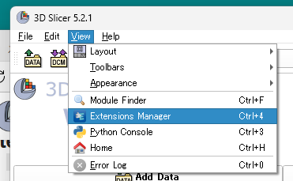
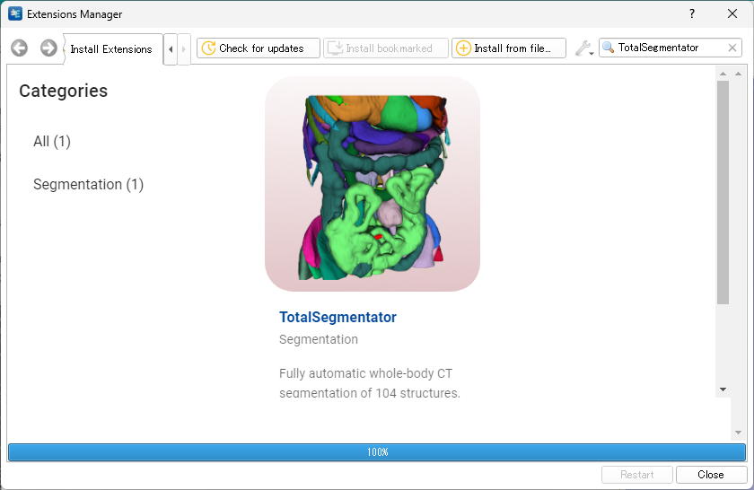
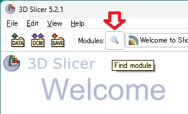
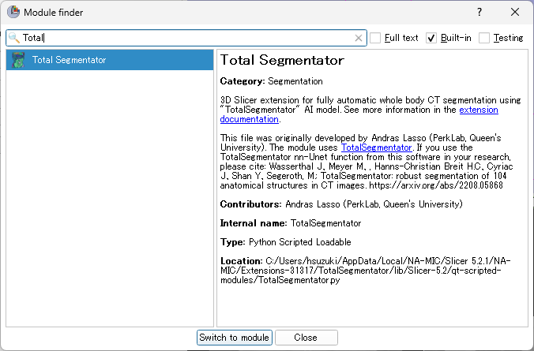
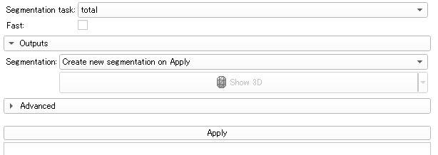
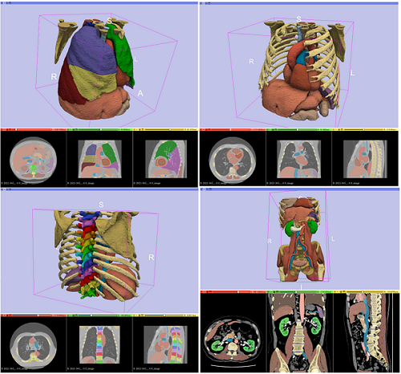

# How to install TotalSegmentator into 3D Slicer (Jpn edit) 
この資料は、以下のWebページおよび動画に基づいて作成されています。
- [New extension: Fully automatic whole-body CT segmentation in 2 minutes using TotalSegmentator](https://discourse.slicer.org/t/new-extension-fully-automatic-whole-body-ct-segmentation-in-2-minutes-using-totalsegmentator/26710)
- [Automatic whole-body CT segmentation in 2 minutes using 3D Slicer and TotalSegmentator](https://www.youtube.com/watch?v=osvMB5SKcVQ)

## TotalSegmentatorとは？
- 多くの臓器を同時にセグメンテーションできます。対象部位は104（すべての腹部臓器、骨、大血管、筋肉）あります。
- 非常に堅牢です。画像解像度や視野に関係なく、全身、腹部、胸部の CT 画像をセグメント化することができます。
- 高速で動作します。フル解像度での計算時間は、CUDA 対応の GPU で 1～2 分、CPU の低解像度モードでは約 1 分です。
- 完全に緻密なセグメンテーションではありません（実行してみると分かりますが、セグメンテーションエラーは起こります）。しかし、3Dビジュアリゼーションや定量化、関心領域の指定、レジストレーションに利用できる精度があります。
- GPUなしでも動作します。ただし、高解像度のセグメンテーションにはCUDA対応のGPUが推奨されます（GPU：1～2分、CPU：40～50分）。

## インストール
1. 3D Slicerを起動し、「View」から「Extensions Manager」を選択します。  

2. Extensions Managerの右上にある「Search」で「TotalSegmentator」と検索すると、該当するモジュールが表示されます。  

3. 「Install」をクリックします。
4. 3D Slicerを再起動します。

## 実行
1. CT画像を読み込みます（DICOM形式やnii.gz形式など）。
2. モジュール検索をクリックします。「Module finder」が起動します。  

3. 左上の検索バーで「TotalSegmentator」を検索すると、当該モジュールが見つかりますので、「Switch to module」をクリックします。  

4. 「Apply」をクリックするとTotalSegmentatorが動作します。

## 実行結果例

## 参考文献
- TotalSegmentatorのGitHubリポジトリは[こちら](https://github.com/wasserth/TotalSegmentator
)
- Wasserthal, Jakob, et al. "TotalSegmentator: robust segmentation of 104 anatomical structures in CT images." arXiv preprint arXiv:2208.05868 (2022). ([arXiv](https://arxiv.org/abs/2208.05868))
